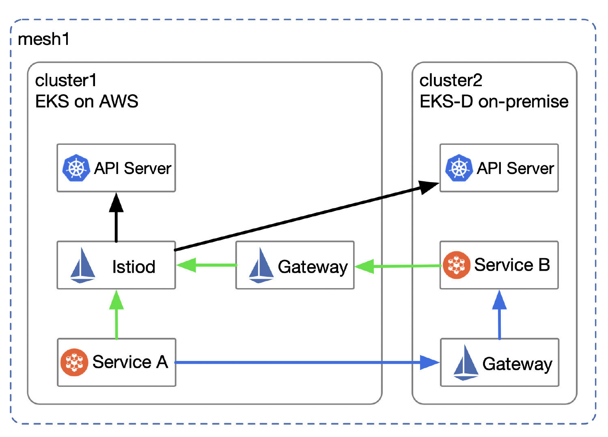

AWS 在 2020 年12 月举行的 re:Invent 大会上发布了 [EKS-D](https://distro.eks.amazonaws.com/)，此举旨在联合合作伙伴，开源 AWS 维护大规模 EKS 集群的经验，帮助用户实现混合云场景下 Kubernetes 的一致性的体验。本文将为你解析 EKS-D 的战略意义，说明它是如何与 Istio 共同保证混合云环境一致性的。

## 什么是 EKS-D？

EKS-D 是 Amazon EKS 的一个发行版，可以运行在企业内部、云端或自己的系统上。EKS-D 保持与 Kubernetes 新版本同期发布。在不久的将来，将以 EKS Anywhere（EKS-A）为名，提供 EKS-D 的支持、打包产品和安装方法。

下图展示了 AWS、EKS-D、 Kubernetes 及用户之间的关系。

EKS-D 对于 AWS、合作伙伴及用户来说具有不同的意义。

- AWS：增加 AWS 的市场拥有率
- 合作伙伴：整合 AWS 的渠道和客户资源以触达更多用户
- 用户：保证了异构环境下的 Kubernetes 的一致性，简化运维

如今企业要考虑选择哪个云供应商要考虑很多因素，同时，还有很多企业的 IT 难以跨入云，而是继续依赖究竟考验的传统 IT 架构以开展业务。

在上云的时候客户希望在企业内部和云端获得一致的体验，以便进行迁移或实现混合云设置。不是所有应用都适合跨云迁移，为了合规、数据安全等种种原因，多集群、混合云的使用场景将很普遍。

## 为什么使用多集群和混合云

我们在很多情况下或使用多集群、混合云等部署方式，例如：

- 为了避免厂商锁定，便于应用跨集群迁移；
- 为了实现应用的高可用；
- 当一个集群的规模过大造成性能瓶颈时；
- 为了合规和数据安全；
- 为了就近部署，降低网络延迟，提高用户体验；
- 为了进行一些测试；
- 突发业务，需要集群扩容；

以上情况经常发生，对集群的管理造成了挑战。Kubernetes 统一了容器编排的标准，随着其进一步普及，更有望成为云原生应用的底层 API。但是对于如何管理多集群和混合云环境中的 Kubernetes 集群，又为我们带来了新的挑战。

## 使用 Istio service mesh 管理混合云

Istio 服务网格作为云原生应用的网络基础设施层，可以同时管理 Kubernetes 及非容器负载，如[虚拟机](https://thenewstack.io/how-to-integrate-virtual-machines-into-istio-service-mesh/)。Istio 可以在[多种平台](https://istio.io/latest/docs/setup/platform-setup/)中部署，又支持多种[部署模式](https://istio.io/latest/docs/ops/deployment/deployment-models/)，兼具管理多集群和混合云的功能.在部署时需要充分考虑 Region、Zone 的分布、网络隔离、多租户、控制平面的高可用等因素。

假如我们同时使用 EKS 和部署在私有数据中心中的 EKS-D，那么如何将两个集群使用一个统一的控制平面管理起来呢？如下图所示，cluster1 和 cluster2 分别表示部署在 EKS 和 EKS-D 的 Kubernetes 集群，这两个集群的网络是隔离的，现因为上文所说的适合使用混合云某个场景，现在为了将它们纳入同一个服务网格使用一个控制平面来管理，我们采用了 [Primary-Remote 多网络](https://istio.io/latest/docs/setup/install/multicluster/primary-remote_multi-network/)的部署模式。

图示：

- 图中黑色箭头表示控制平面内获取服务和端点配置的请求；
- 图中蓝色箭头表示服务 A 访问服务 B 的路由；
- 图中绿色箭头表示服务 A/B 向控制平面获取服务端点的路由；

使用该模式部署 Istio 时，需要保证控制平面对 Kubernetes 的 API Server 的连接性，具体的安装过程请参考 [Istio 文档](https://istio.io/latest/docs/setup/install/multicluster/primary-remote_multi-network/)。

## 总结

EKS-D 保证了在混合云环境下 Kubernetes 集群的一致性，降低了集群的运维成本。Istio 固有的多集群感知能力，进一步从服务层面增强了用户体验的一致性，帮助我们将多集群中的服务纳入统一的控制平面管理。EKS-D 发布的时有众多的合作伙伴的响应，其中 Tetrate 作为 Istio service mesh 的解决方案供应商提供了 [Tetrate Service Bridge（TSB）](https://www.tetrate.io/tetrate-service-bridge/)在 EKS 和 EKS-D 上实现了跨工作负载的统一应用连接和安全性。