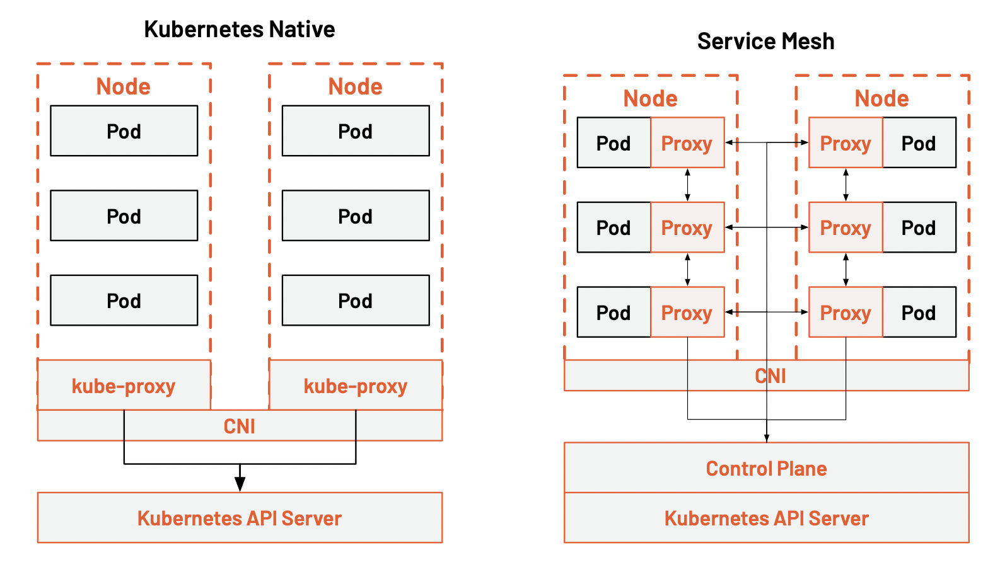
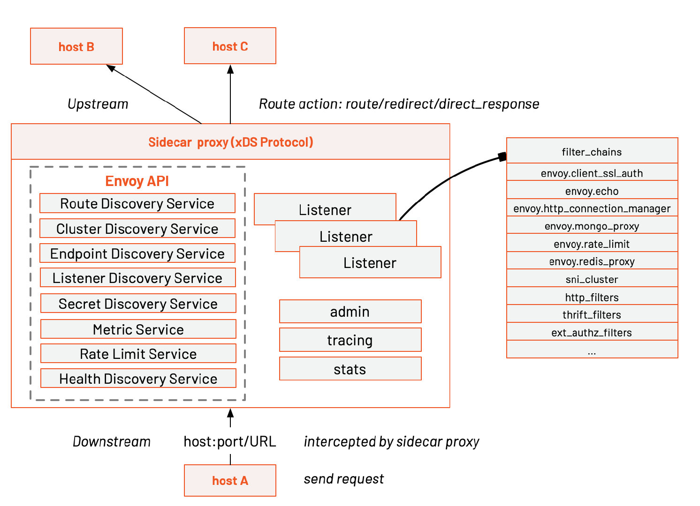
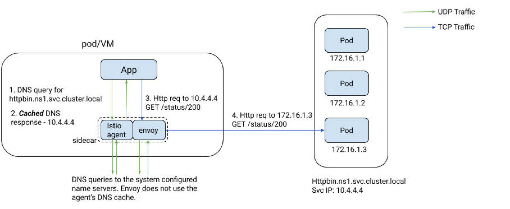
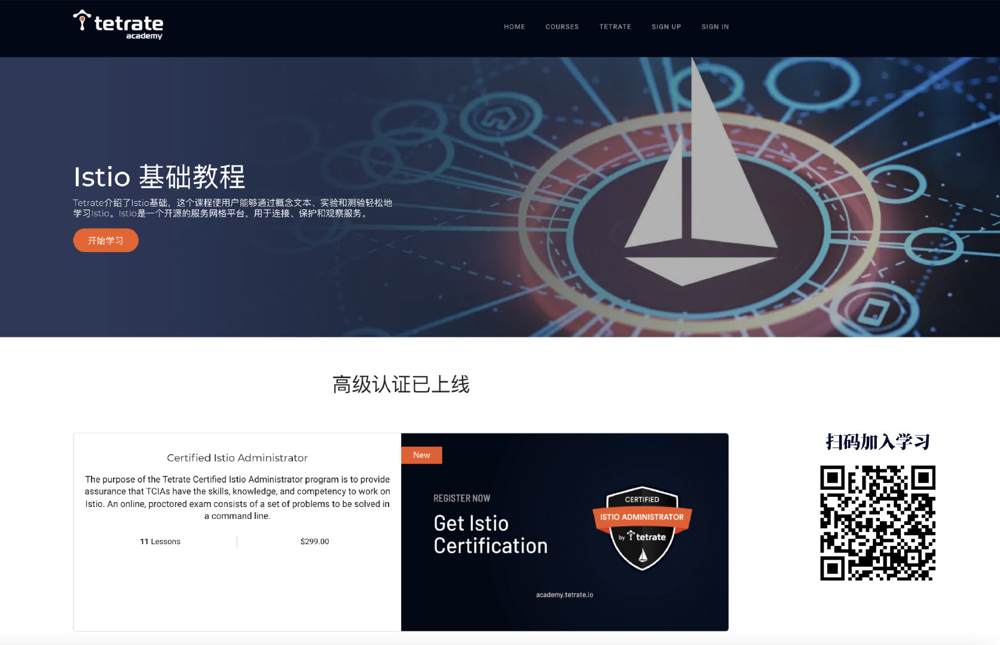
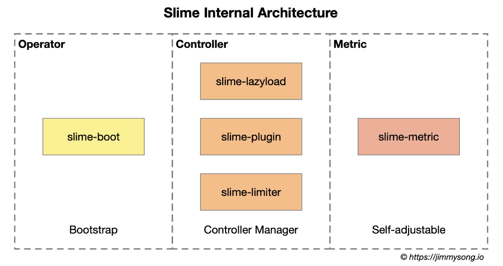
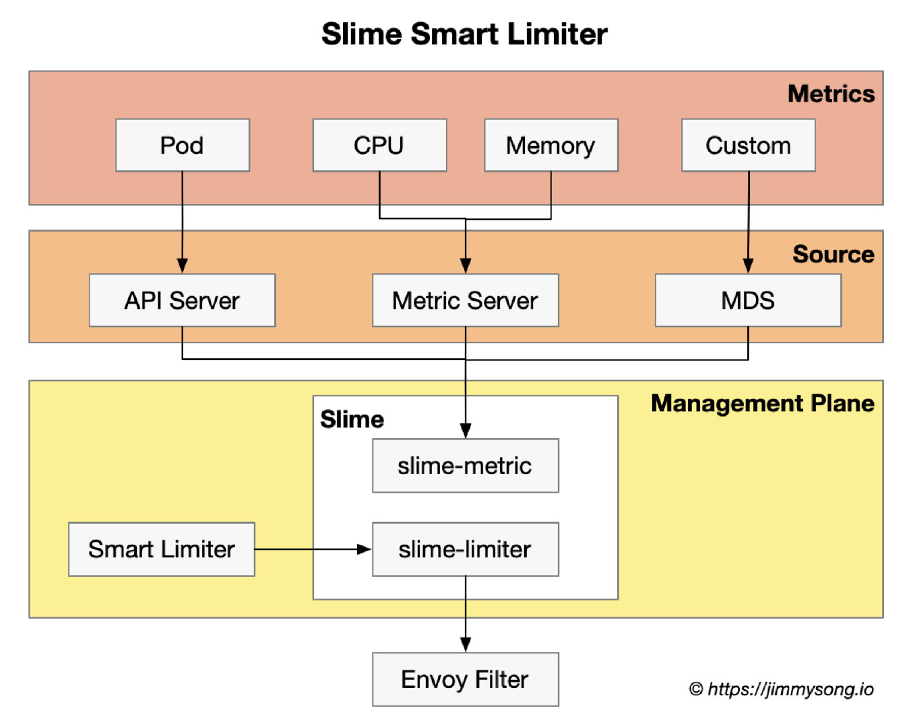
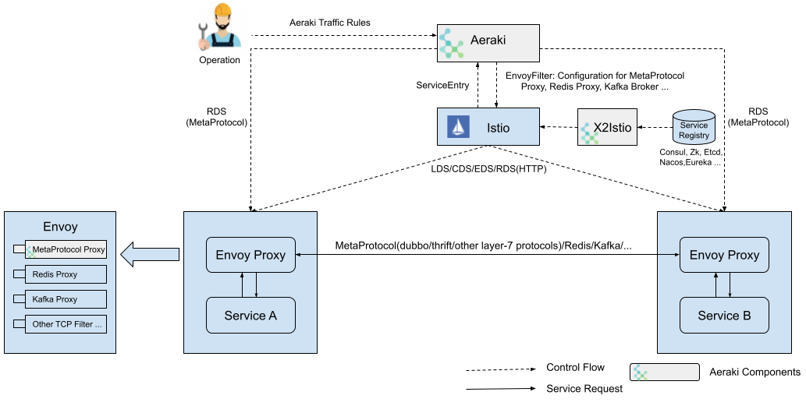
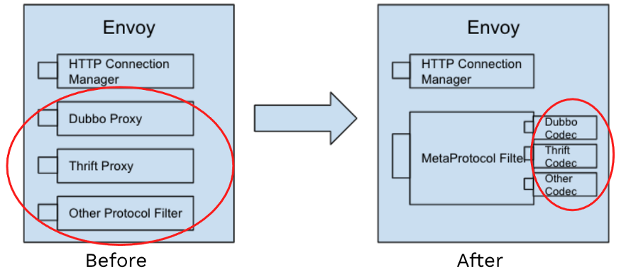
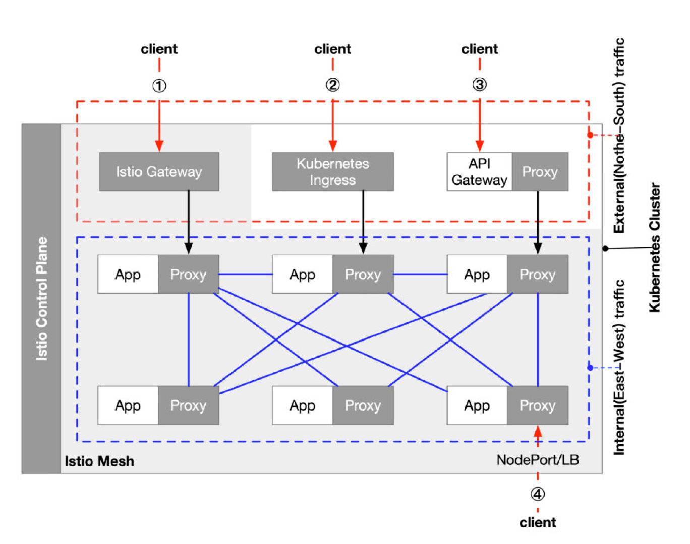

本文根据 2021 年 11 月 22 日晚我应极客邦邀请在「极客时间训练营」的直播分享《云原生漫谈：聊聊 Service Mesh 的现状》整理而成。

本来极客时间是想邀请我分享云原生的，但我觉得那个范围太大，在一次分享中只能泛泛而谈，无法聚焦到一个具体的点，因此我想还是先聚焦在服务网格这一个专题上吧。云原生社区最近倒是在做一个[云原生系列的分享](https://mp.weixin.qq.com/s/FWUkc1HJobhZgb26pG73Cg)，大家可以关注下。

这是我今天分享的大纲：

1. 第一探讨下服务网格跟云原生的关系
2. 第二是给大家陈述下我观察到的目前社区里关于服务网格有哪些争论
3. 第三是给大家介绍几个服务网格的相关的开源项目
4. 最后是畅想下服务网格未来的发展

## 服务网格与云原生的关系

首先我们将探讨下服务网格与云原生的关系。

### 服务网格——容器编排大战后的产物


如果你关注云原生领域足够早的话，应该还会对 2015 到 2017 年间的容器编排大战记忆犹新。关于服务网格的起源已经无需多言。2017 年 Kubernetes 获得了容器大战的胜利，微服务的理念已经深入人心，容器化的趋势可谓势不可挡。Kubernetes 架构趋向成熟，慢慢变得无聊，以 Linkerd、Istio 为代表的服务网格技术进入了 CNCF 定义的云原生关键技术视野中。

服务网格将微服务中的通用的功能给下沉到了基础设施层，让开发者可以更加专注于业务逻辑，从而加快服务交付，这与整个云原生的理念的一致的。你不需要再在应用中集成笨重的 SDK，为不同语言开发和维护 SDK，应用部署完后，使用服务网格进行 Day 2 操作即可。

Kubernetes 设计之初就是按照云原生的理念设计的，云原生中有个重要概念就是微服务的架构设计，当将单体应用拆分微服务后， 随着服务数量的增多，如何微服务进行管理以保证服务的 SLA 呢？为了从架构层面上解决这个问题，解放程序员的创造性，避免繁琐的服务发现、监控、分布式追踪等事务，服务网格应运而生。


来源：*<https://developers.redhat.com/blog/2016/12/09/spring-cloud-for-microservices-compared-to-kubernetes>*

服务网格被誉为下一代微服务，从右面这幅图里我们可以看到微服务的一些关注点，这些关注点很多与 Kubernetes 的功能是重合的，既然这些作为平台级的功能 Kubernetes 已经提供了，为什么还要使用服务网格呢？其实 Kubernetes 关注的还是应用的生命周期，它管理的对象是资源和部署，对于服务的管控力度很小。而服务网格正好弥补了这个缺陷。服务网格可以连接、控制、观察和保护微服务。

### Kubernetes vs xDS vs Istio

这幅图展示的是 Kubernetes 和 Istio 的分层架构图。



从图中我们可以看到 kube-proxy 的设置是全局的，无法对每个服务进行细粒度的控制，Kubernetes 可以做的只有拓扑感知路由、将流量就近路由，为 Pod 设置进出站的网络策略。

而服务网格通过 sidecar proxy 的方式将 Kubernetes 中的流量控制从服务层中抽离出来，为每个 Pod 中注入代理，并通过一个控制平面来操控这些分布式代理。这样可以实现更大的弹性。

Kube-proxy 实现了一个 Kubernetes 服务的多个 pod 实例之间的流量负载均衡，但如何对这些服务之间的流量进行精细化控制–比如将流量按百分比划分给不同的应用版本（这些应用版本都是同一个服务的一部分，但在不同的部署上），或者做金丝雀发布（灰度发布）和蓝绿发布？

Kubernetes 社区给出了一个使用 Deployment 做金丝雀发布的方法，本质上是通过修改 pod 的标签来给部署的服务分配不同的 pod。



目前在中国最流行的服务网格开源实现是 Istio，也有很多公司对 Istio 进行了二次开发，比如蚂蚁、网易、腾讯等，其实 Istio 是在 Envoy 的基础上开发的，从它开源的第一天起就默认使用了 Envoy 作为它的分布式代理。Envoy 开创性的创造了 xDS 协议，用于分布式网关配置，大大简化了大规模分布式网络的配置。2019 年蚂蚁开源的 MOSN 同样支持了 xDS。Envoy 还是 CNCF 中最早毕业的项目之一，经过大规模的生产应用考验。可以说 Istio 的诞生已经有了很好的基础。

下表是 Kubernetes、xDS、Istio 三者之间的资源抽象对比。

| **Kubernetes** | **xDS**  | **Istio 服务网格** |
| -------------- | -------- | ------------------ |
| Endpoint       | Endpoint | WorkloadEntry      |
| Service        | Route    | VirtualService     |
| kube-proxy     | Route    | DestinationRule    |
| kube-proxy     | Listener | EnvoyFilter        |
| Ingress        | Listener | Gateway            |
| Service        | Cluster  | ServiceEntry       |

kube-proxy 组件、xDS 和 Istio 对流量管理的抽象后，现在我们仅从流量管理的角度来看看这三个组件 / 协议的比较。请注意，三者并不完全等同。Kubernetes 更加注重的是应用层面的流量管理，xDS 是更加抽象的协议层面的配置下发，而 Istio 是服务层面的配置。

### 服务网格——云原生网络基础设施

在列举过以上 Kubernetes 和服务网格的对比后，我们可以看出服务网格在云原生应用架构中的地位。那就是构建一个云原生网络基础设施，具体来说就是：

- 流量管理：控制服务间的流量和API调用流，使调用更可靠，增强不同环境下的网络鲁棒性。
- 可观测性：了解服务之间的依赖关系和它们之间的性质和流量，提供快速识别定位问题的能力。
- 策略实施：通过配置网格而不是以改变代码的方式来控制服务之间的访问策略。
- 服务识别与安全：提供在网格里的服务可识别性和安全性保护。

## 社区里关于 Istio 和服务网格的争论

然而构建基础设施，可谓牵一发而动全身。理想很丰满，现实很骨感。关于服务网格和 Istio，在社区中也不乏争论。我们来看看有这些争论主要有哪些。

这里列举了我在社区中观察到的关于 Istio 和服务网格最常见的几个问题。

1. 有人在生产使用 Istio 吗？
2. 为 pod 注入 sidecar 后带来的大量资源消耗，影响应用性能？
3. Istio 支持的协议有限，不易扩展？
4. Istio 太过复杂，老的服务迁移成本太高，业界经验太少，学习曲线陡峭？

第一个问题，也是很多人刚加入社区和了解这门技术的时候，问的第一个问题，那是有人在生产使用 Istio 吗？

随着对 Istio 研究的深入，很多人就会抛出第二个问题，为 pod 注入 sidecar 后带来的大量资源消耗，会影响应用性能吗？

如果能问到第三个问题，说明对 Istio 有比较强的需求了，大多是使用了自定义的 RPC，对 Istio 的协议扩展有需求。
 最后一个问题是抱怨 Istio 的概念太过复杂，也没有一个清晰的迁移路径可以使用，学习曲线太过陡峭。

下面我将一一回答这些问题。

### Istio 架构稳定，生产可用，生态渐起


首先我们来看下 Istio 的发布时间表，1.12 版本在上周刚刚发布，这里列举了从它开源到 1.8 版本发布的时间表。2018 年可以说是服务网格爆发之年，Tetrate 也在这一年成立。自1.5 版本起 Istio 正式确立了当前的架构。Istio 社区也也举办了丰富多彩的活动，2021 年 3 月首届 IstioCon 召开，7 月 Istio Meetup China 在北京举行，2022 年 1 月，Service Mesh Summit 2022 也将在上海举行。

Istio 有着庞大的社区以及[供应商和用户群体](https://istio.io/latest/about/case-studies/)。目前主流公有云全都支持了 Istio 服务网格，如阿里云、华为云、腾讯云、网易云等，Istio 的官网上也列举了几十个社区用户，云原生社区 Istio SIG 还陆续举办了八场 [Istio 大咖说](https://cloudnative.to/sig-istio/big-talk/overview.html)，百度、腾讯、网易、小红书、小电科技都来分享过他们的 Istio 实践。

还有很多企业基于 Istio 做了二次开发或者适配或者为其开发插件，可以说是 Istio 架构已稳定，生产可用，生态正在萌芽中。

### 服务网格对应用性能的影响

服务网格为了做到对应用程序透明，默认采用了 iptables 流量劫持的方式，当服务数量大的时候会有大量的 iptables 规则，影响网络性能，你可以使用 [eBPF](https://cloudnative.to/blog/how-ebpf-streamlines-the-service-mesh/) 这样的技术来提高应用性能，但是该技术对操作系统内核的版本要求比较高，很少有企业能够达到。



来源：<https://cloudnative.to/blog/istio-dns-proxy/>

还有一种方式，也是[小红书使用的方式](https://cloudnative.to/sig-istio/big-talk/ep08.html)，那就是利用 Istio 1.8 中引入的智能 DNS 代理功能。首先使用 ServiceEntry 定义服务，让所有服务属于一个 VIP 范围，再利用 Istio 的智能 DNS 代理功能，让sidecar只拦截 VIP 网段的流量，这样可以减少 iptables 规则，从而提高性能。如果想深入了解这个做法的细节，大家可以去浏览 [Istio 大咖说第八期的分享视频](https://www.bilibili.com/video/BV12b4y187ae/)。

Istio 在初期是将整个网格内的所有服务的路由信息全量下发到所有的 proxy sidecar 中，会导致 sidecar 占用大量资源，后来 Istio 引入了 [Sidecar 资源](https://istio.io/latest/docs/reference/config/networking/sidecar/)来精细化控制需要下发的代理配置范围，另外还有企业自己开发了配置懒加载功能，例如腾讯云开源的 [Aeraki](https://github.com/aeraki-framework/aeraki)、网易开源的 [Slime](https://github.com/slime-io/slime) 都可以实现配置懒加载。我们会在 Istio 开源生态中介绍这两个开源项目。

最后是一个涉及到 Sidecar proxy 运维的问题，如何在保证流量不断的情况下，升级所有 Envoy 代理，这个阿里开源的 [OpenKruise](https://github.com/openkruise/kruise) 中的 [SidecarSet](https://xie.infoq.cn/article/23ae6d3f0d0260b4797a708a0) 资源已经给出了解决方案。

另外 Sidecar 的引入带来的资源消耗以及网络延迟也是在合理的范围内，大家可以参考 Istio 官方博客上的 [Service Mesh 基准性能测试](https://istio.io/latest/zh/blog/2019/performance-best-practices/)。

### 扩展 Istio 服务网格

下一个问题是关于扩展 Istio 服务网格的。目前官方社区给出的方案是使用 WebAssembly，目前这种扩展方式在国内用的还比较少，而且性能也堪忧。我观察到的大部分解决方案都是自定义 CRD，基于 Istio 构建服务网格管理平面。

另外，让 Istio 支持异构环境，适用于一切工作负载，如虚拟机、容器，这个对于终端用户来说也有很强的需求，因为这可以让用户很方便的从传统负载迁移应用到服务网格中。最后是多集群、多网格的混合云流量管理，这个属于比较高阶的需求了。

### 陡峭的学习曲线

以下列举的是 Istio 学习资源：

- [Istio 官网中文文档](https://istio.io/latest/zh/)
- [IstioCon 2021](https://events.istio.io/istiocon-2021/)
- Istio Meetup China
- [Istio 大咖说/Istio Weekly](https://github.com/tetratelabs/istio-weekly)
- [云原生社区 Istio SIG](https://cloudnative.to/sig-istio/)
- [Istio 基础教程（中文）](https://academy.tetrate.io/courses/istio-fundamentals-zh)
- [Certified Istio Administrator](https://academy.tetrate.io/courses/certified-istio-administrator)

Istio 开源至今已有 4 年时间，2018 年时我和敖小剑一起创建了 ServiceMesher 社区，当时组织过 9 次 Service Mesh Meetup，同其他服务网格爱好者一起翻译了 Istio 的官方文档。我还在今年初参与了 IstioCon 2021 的筹办及首届 Istio Meetup China。可以说是亲眼目睹了国内服务网格技术的应用和发展，在这期间也写过和翻译过大量的文章，加入 Tetrate 后，我还参与发布了 Istio 基础教程，免费提供给大家学习。同时 Tetrate 也推出了认证 Istio 管理员考试，用于培养更多行业人才。

云原生社区组织了 Istio SIG，还推出了 Istio 大咖说直播栏目，为大家分享 Istio 服务网格实践经验。

下图是 [Istio 基础教程](https://academy.tetrate.io/courses/istio-fundamentals-zh)的首页截图。



如果你是刚开始接触服务网格和 Istio，可以先从 Istio 基础教程开始学起。这个线上系列课程是图文并茂的中文课程，可以免费参加。

好了，我们再来了解下服务网格的社区项目。

## Istio 开源生态

下表中罗列的是基于 Istio 的开源项目。

| **项目名称**                                                 | **开源时间**  | **类别** | **描述**                                               | **主导公司** | **Star 数量** | **与 Istio 的关系**                           |
| ------------------------------------------------------------ | ------------- | -------- | ------------------------------------------------------ | ------------ | ------------- | --------------------------------------------- |
| [Envoy](https://github.com/envoyproxy/envoy)                 | 2016年 9 月   | 网络代理 | 云原生高性能边缘/中间服务代理                          | Lyft         | 18300         | 默认的数据平面                                |
| [Istio](https://github.com/istio/istio/)                     | 2017 年 5 月  | 服务网格 | 连接、保护、控制和观察服务。                           | Google       | 28400         | 控制平面                                      |
| [Emissary Gateway](https://github.com/emissary-ingress/emissary) | 2018 年 2 月  | 网关     | 用于微服务的 Kubernetes 原生 API 网关，基于 Envoy 构建 | Ambassador   | 3500          | 可连接 Istio                                  |
| [APISIX](https://github.com/apache/apisix)                   | 2019 年 6 月  | 网关     | 云原生 API 网关                                        | API7         | 7400          | 可作为 Istio 的数据平面运行也可以单独作为网关 |
| [MOSN](https://github.com/mosn/mosn)                         | 2019 年 12 月 | 代理     | 云原生边缘网关及代理                                   | 蚂蚁         | 3400          | 可作为 Istio 数据平面                         |
| [Slime](https://github.com/slime-io/slime)                   | 2021 年 1月   | 扩展     | 基于 Istio 的智能服务网格管理器                        | 网易         | 204           | 为 Istio 增加一个管理平面                     |
| [GetMesh](https://github.com/tetratelabs/getmesh)            | 2021 年 2 月  | 工具     | Istio 集成和命令行管理工具                             | Tetrate      | 91            | 实用工具，可用于 Istio 多版本管理             |
| [Aeraki](https://github.com/aeraki-framework/aeraki)         | 2021 年 3 月  | 扩展     | 管理 Istio 的任何七层负载                              | 腾讯         | 280           | 扩展多协议支持                                |
| [Layotto](https://github.com/mosn/layotto/)                  | 2021 年 6 月  | 运行时   | 云原生应用运行时                                       | 蚂蚁         | 325           | 可以作为 Istio 的数据平面                     |
| [Hango Gateway](https://github.com/hango-io/hango-gateway)   | 2021 年 8 月  | 网关     | 基于 Envoy 和 Istio 构建的 API 网关                    | 网易         | 187           | 可与 Istio 集成                               |

从 2017 年 5 月 Istio 开源至今也有 4 年多了，虽然该项目在 GitHub 上已经有很高的关注度，并发布了 10 几个版本，但其开源生态还在萌芽期。这张表列举了 Istio 生态中的开源项目，统计截止到 2021 年 11 月 11 日，表格按照开源时间排序。这些项目在 Istio 服务网格之上增强了网关、扩展和实用工具等。我将挑选其中 2 个来着重分享下。

### Slime：基于 Istio 的智能服务网格管理器

Slime 是由网易数帆微服务团队开源的一款基于 Istio 的智能网格管理器。Slime 基于 Kubernetes Operator 实现，可作为 Istio 的 CRD 管理器，无缝对接 Istio，无须做任何定制化改造，定义动态的服务治理策略，从而达到自动便捷使用 Istio 和 Envoy 高阶功能的目的。

Slime 试图解决以下问题：

- 在 Istio 中如何实现高阶扩展的问题，比如扩展 HTTP 插件，限流功能比较单薄，无法根据服务的资源使用率做到自适应限流
- 解决 Sidecar 配置全量下发消耗大量资源导致应用性能变差的问题

Slime 解决以上问题的答案是构建 Istio 的管理平面，其核心思路是：

- 构建可拔插控制器
- 数据平面监控
- CRD 转换

下图是 Istio 作为 Istio 管理平面的流程图。


Slime 管理 Istio 的具体步骤如下：

1. Slime Operator 根据管理员的配置在 Kubernetes 中完成 Slime 组件的初始化；
2. 开发者创建符合 Slime CRD 规范的配置并应用到 Kubernetes 集群中；
3. Slime 查询 Prometheus 中保存的相关服务的监控数据，结合 Slime CRD 中自适应部分的配置，将 Slime CRD 转换为 Istio CRD，同时将其推送到 Global Proxy 中；
4. Istio 监听 Istio CRD 的创建；
5. Istio 将 Sidecar Proxy 的配置信息推送到数据平面相应的 Sidecar Proxy 中；

下图展示的 Slime 的内部架构图。



作为 Istio 的管理平面，可以将 Slime 的核心看做是 Istio 的一个 Operator。

Slime 内部分为三大组件：

- **slime-boot**：在 Kubernetes 上部署 Slime 模块的 operator。
- **slime-controller**：Slime 的核心组件，监听 Slime CRD 并将其转换为Istio CRD。
- **slime-metric**：用于获取服务 metrics 信息的组件，slime-controller 会根据其获取的信息动态调整服务治理规则。

下图展示的是 Slime 自适应限流的架构图。



Envoy 内置的限流组件功能单一，只能以实例维度配置限流值，无法做到根据应用负载的自适应限流。Slime 通过与 Prometheus metric server 对接，实时的获取监控情况，来动态配置限流值。

Slime 的自适应限流的流程分为两部分，一部分为 SmartLimiter 到 [EnvoyFilter](https://istio.io/latest/docs/reference/config/networking/envoy-filter/) 的转换，另一部分为获取监控数据。目前 Slime 支持从 Kubernetes Metric Server 获取服务的CPU、内存、副本数等数据。Slime 还对外提供了一套监控数据接口（Metric Discovery Server），通过 MDS，可以将自定义的监控指标同步给限流组件。

Slime 创建的 CRD SmartLimiter 用于配置自适应限流。其的配置是接近自然语义，例如希望在 CPU 超过 80% 时触发服务 A 的访问限制，限额为 30QPS，对应的 SmartLimiter 定义如下：

```yaml
apiVersion: microservice.netease.com/v1alpha1
kind: SmartLimiter
metadata:
  name: a
  namespace: default
spec:
  descriptors:
  - action:
      fill_interval:
        seconds: 1
      quota: "30/{pod}"    # 30 为该服务的额度，将其均分给每个 pod，加入有 3 个 pod，则每个 pod 的限流为 10
    condition: "{cpu}>0.8" # 根据监控项{cpu}的值自动填充该模板
```

### Aeraki：在 Istio 中管理任何七层协议

Aeraki 是腾讯云在 2021 年 3 月开源的一个服务网格领域的项目。Aeraki 提供了一个端到端的云原生服务网格协议扩展解决方案，以一种非侵入的方式为 Istio 提供了强大的第三方协议扩展能力，支持在 Istio 中对 Dubbo、Thrift、Redis，以及对私有协议进行流量管理。Aeraki 的架构如下图所示：



来源：<https://istio.io/latest/blog/2021/aeraki/>

从 Aeraki 架构图中可以看到，Aeraki 协议扩展解决方案包含了两个组件：

- Aeraki：Aeraki 作为一个 Istio 增强组件运行在控制面，通过自定义 CRD 向运维提供了用户友好的流量规则配置。Aeraki 将这些流量规则配置翻译为 Envoy 配置，通过 Istio 下发到数据面的 sidecar 代理上。Aeraki 还作为一个 RDS 服务器为数据面的 MetaProtocol Proxy 提供动态路由。Aeraki 提供的 RDS 和 Envoy 的 RDS 有所不同，Envoy RDS 主要为 HTTP 协议提供动态路由，而 Aeraki RDS 旨在为所有基于 MetaProtocol 框架开发的七层协议提供动态路由能力。
- MetaProtocol Proxy：基于 Envoy 实现的一个通用七层协议代理。依托 Envoy 成熟的基础库，MetaProtocol Proxy 是在 Envoy 代码基础上的扩展。它为七层协议统一实现了服务发现、负载均衡、RDS 动态路由、流量镜像、故障注入、本地/全局限流等基础能力，大大降低了在 Envoy 上开发第三方协议的难度，只需要实现编解码的接口，就可以基于 MetaProtocol 快速开发一个第三方协议插件。

如果没有使用 MetaProtocol Proxy，要让 Envoy 识别一个七层协议，则需要编写一个完整的 TCP filter，这个 filter 需要实现路由、限流、遥测等能力，需要投入大量的人力。对于大部分的七层协议来说，需要的流量管理能力是类似的，因此没有必要在每个七层协议的 filter 实现中重复这部分工作。Aeraki 项目采用了一个 MetaProtocol Proxy 来统一实现这些能力，如下图所示：


基于 MetaProtocol Proxy，只需要实现编解码接口部分的代码就可以编写一个新的七层协议 Envoy Filter。除此之外，无需添加一行代码，Aeraki 就可以在控制面提供该七层协议的配置下发和 RDS 动态路由配置。



Aeraki + MetaProtocol 套件降低了在 Istio 中管理第三方协议的难度，将 Istio 扩展成为一个支持所有协议的全栈服务网格。目前 Aeraki 项目已经基于 MetaProtocol 实现了 Dubbo 和 Thrift 协议。相对 Envoy 自带的 Dubbo 和 Thrift Filter，基于 MetaProtocol 的 Dubbo 和 Thrift 实现功能更为强大，提供了 RDS 动态路由，可以在不中断存量链接的情况下对流量进行高级的路由管理，并且提供了非常灵活的 Metadata 路由机制，理论上可以采用协议数据包中携带的任意字段进行路由。QQ 音乐和央视频 APP 等业务也正在基于 Aeraki 和 MetaProtocol 进行开发，以将一些私有协议纳入到服务网格中进行管理。

除此之外，[Aeraki Framework](https://github.com/aeraki-framework) 中还提供了 xDS 配置下发优化的 lazyXDS 插件、Consul、etcd、Zookeeper 等各种第三方服务注册表对接适配，Istio 运维实战电子书等工具，旨在解决 Istio 在落地中遇到的各种实际问题，加速服务网格的成熟和产品化。

## 服务网格的未来发展

最后我想讲一下对于服务网格未来发展的一些看法。

### 让 Istio 适用于一切环境和一切工作负载

我们看到了网易、腾讯主要是通过构建 Operator 来扩展 Istio，然而这种扩展对于多集群管理来说并不够用。我们知道我们目前的基础设施很多是在向云原生化或者是容器化转型，那么就存在一个容器、虚拟机等共存的环境。这就是异构环境，这些不同环境的流量如何统一管理呢？其实使用 Istio 是可以做到的。同样是要在 Istio 之上构建一个管理平面，并增加一个抽象层，增加适用于集群管理的 CRD，比如集群流量配置、集群策略配置等。另外还要在每个集群中部署一个 Gateway，统一连接到一个边缘代理，让所有的集群互联。这也是 Tetrate Service Bridge 的产品理念。

下图展示的 [Tetrate Service Bridge](https://www.tetrate.io/tetrate-service-bridge/) 架构图。


### API 网关与服务网格的融合

下图展示了使用 Istio Gateway、Kubernetes Ingress、API Gateway 及 NodePort/LB 暴露 Istio mesh 中服务的四种方式。



其中阴影表示的是 Istio mesh，mesh 中的的流量属于集群内部（东西向）流量，而客户端访问 Kubernetes 集群内服务的流量属于外部（南北向）流量。不过因为 Ingress、Gateway 也是部署在 Kubernetes 集群内的，这些节点访问集群内其他服务的流量就难以归属了。

在 Istio mesh 中你可以使用多种 Kubernetes Ingress Controller 来充当入口网关，当然你还可以直接使用 Istio 内置的 Istio 网关，对于策略控制、流量管理和用量监控可以直接通过 Istio 网关来完成，这样做的好处是通过 Istio 的控制平面来直接管理网关，而不需要再借助其他工具。但是对于 API 声明周期管理、复杂的计费、协议转换和认证等功能，传统的 API 网关可能更适合你。所以，你可以根据自己的需求来选择，也可以组合使用。

下表中列出了 Istio Mesh 中暴露服务的四种方式。

| **方式**              | **控制器**         | **功能**                                                     |
| --------------------- | ------------------ | ------------------------------------------------------------ |
| NodePort/LoadBalancer | Kubernetes         | 负载均衡                                                     |
| Kubernetes Ingress    | Ingress Controller | 负载均衡、TLS、虚拟主机、流量路由                            |
| Istio Gateway         | Istio              | 负载均衡、TLS、虚拟主机、高级流量路由、其他 Istio 的高级功能 |
| API 网关              | API Gateway        | 负载均衡、TLS、虚拟主机、流量路由、API 生命周期管理、权限认证、数据聚合、账单和速率限制 |

目前有些传统的反向代理也在向 Service Mesh 方向发展，如 Nginx 构建了 Nginx Service Mesh，Traefik 构建了 Traefik Mesh。还有的 API 网关产品也向 Service Mesh 方向挺进，比如 Kong 发展出了 Kuma。在未来，我们会看到更多 API 网关、反向代理和服务网格的融合产品出现。

### 你是否真的需要服务网格？

在使用服务网格前，请考虑以下问题：

- 你的团队多少人里投入服务网格开发？使用 Kubernetes、Istio 的经验？
- 你有多少微服务？这些微服务使用什么语言？
- 你的服务都运行在哪些平台上？
- 你的应用已经容器化并使用 Kubernetes 管理了吗？
- 你的服务有多少是部署在虚拟机、有多少是部署到 Kubernetes 集群上，比例如何？
- 你的团队有制定转移到云原生架构的计划吗？
- 你想使用 Istio 的什么功能？Istio 的稳定性是否能够满足你的需求？
- 你是否可以忍受 Istio 带来的性能损耗？
- 你选择自建或者采购？

## 总结

最后总结一下今天的分享：

- 从容器编排争霸到服务网格，我们可以看到云原生乃至整个云计算就是标准之争。
- 服务网格的目标是成为云原生的网络基础设施，任重而道远。
- 服务网格只是云原生庞大技术栈中的一环，不要一叶障目，技术的发展是永无止境的。
- Istio 架构已经稳定，生产可用，生态正处于萌芽中。
- 对于终端用户来说适合自己的才是最好的。

本人才疏学浅，因为时间的原因，很多内容没有深入展开和探讨，最后欢迎大家加入[云原生社区 Istio SIG](https://cloudnative.to/sig-istio/) 一起交流学习 Istio 和服务网格技术。
